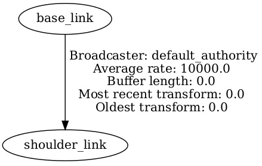

## Creating a URDF for a Robot

In the previous chapter, we started with an intuitive introduction to TFs, or TransForms. You have seen that TFs are very important; they will be the backbone of almost any ROS application. We concluded by saying that in order to generate TFs for a robot, you need to create a **Unified Robot Description Format** (**URDF**) file.

Basically, a URDF file will contain a description of all the elements of a robot. You will define each **link** (rigid part) of the robot. Then, to create relationships between the links, you will add some **joints**, which will be used to generate the TFs.

To write the content of a URDF, we will use XML. As you develop the URDF, you will be able to visualize it with RViz. This will be very helpful to see whether the links and joints/TFs are correct. We will also improve the URDF file and make it more dynamic with an additional tool named **Xacro**.

So, in this chapter, we are going to start the project for _Part 3_, with the URDF for a robot. We will create a mobile base with two wheels. This will be the foundation for the next few chapters. You can find the finalized URDF files inside the **ch11** folder of the book’s GitHub repository ([https://github.com/PacktPublishing/ROS-2-from-Scratch](https://github.com/PacktPublishing/ROS-2-from-Scratch)).

The hardest part about URDF is understanding how to assemble two links of a robot with a joint. Getting to do this without guidance is quite difficult because there are so many parameters and origins you can modify. I will explain the complete process, step by step, to make sure that you build something that works properly.

By the end of this chapter, you will be able to create your own URDF for almost any robot powered by ROS.

In this chapter, we will cover the following topics:

-   Creating a URDF with a link
-   The process of assembling links and joints
-   Creating a URDF for a mobile robot
-   Improving the URDF with Xacro

## Creating a URDF with a link

In this section, you will dive directly in and create your first URDF. We will first create an XML file for the URDF. In this file, we will add a link, which will represent one rigid part of a robot, and visualize it in RViz. We will also explore the different types of shapes you can use—boxes, cylinders, and so on.

This will be a good first step, so you can get familiar with URDF and be ready to dive into the process of adding several links and joints together (in the next section).

Let’s get started by setting up our URDF file.

## Setting up a URDF file

A URDF file is simply an XML file with the **.****urdf** extension.

Now, to keep things simple for this chapter, we will create a URDF file inside our home directory. In the next chapter, you will learn how to correctly package the URDF inside a ROS 2 application.

How should you name the URDF file? You could choose any name; it doesn’t really matter. Usually, you will give it the name of your robot. If your robot’s name is **abc**, then you will create an **abc.urdf** file. Let’s use the name **my\_robot**, as we previously did in this book.

Open a terminal and create a new file in your home directory:

```
$ cd
$ touch my_robot.urdf
```

You can then open this file with any text editor or IDE, for example, with VS Code:

```
$ code my_robot.urdf
```

Here is the minimum code you have to write inside a URDF file:

```
<?xml version="1.0"?>
<robot name="my_robot">
</robot>
```

We first open the file with the **<?xml version="1.0"?>** line, to specify that this file is an XML file—we also give the XML version.

Then, you need to open and close a **<robot>** tag. Everything you write in your URDF will be inside this tag. You also have to provide the name of the robot with the **name** argument.

Now, this is the minimum code for a URDF, but it will be useless if you don’t define at least one element. Let’s add a link inside this URDF.

## Creating a link

You will now write your first link, which corresponds to one rigid part of a robot, and visualize it in RViz. With this, you will be able to see whether the link is correctly defined and modify it if necessary.

Let’s start with the XML code to add the link.

### Basic code for a link

To create a visual element for a link, you can use existing shapes: boxes, cylinders, and spheres (we will also see later how to include a custom shape made from **Computer-Aided Design** (**CAD**) software).

To get started, let’s imagine the main base of a robot, represented as a box. The box is 60 cm x 40 cm x 20 cm, or **0.6** m x **0.4** m x **0.2** m.

Note

In ROS, only the metric system is used. Here are a few units that we will use in this chapter:

\- Meters will be used for distances. If you have to specify 70 mm for example, you will write **0.07**.

\- Radians will be used for angles. 180 degrees corresponds to pi (about **3.14**) radians.

\- Meters per second will be used for velocity instances.

Here is the code for this first link:

```
<robot name="my_robot">
    <link name="base_link">
        <visual>
            <geometry>
                <box size="0.6 0.4 0.2" />
            </geometry>
            <origin xyz="0 0 0" rpy="0 0 0" />
        </visual>
    </link>
</robot>
```

Make sure to define the **<link>** inside the **<robot>** tag. Also, although indentation is not a requirement in XML, the best practice is to add some indentation to get a more readable file. Here, I used four spaces for each indentation.

Let’s analyze the elements of this link. The **<link>** tag defines the link. All the properties for this link must be inside the tag. You also have to provide a **name** attribute for the link. As a convention, for the first link, we use **base\_link**.

Then, inside this tag, we have the **<visual>** tag. If you want to define a visual appearance for the link (rigid part), you can do so with this tag. Inside, you will have the following:

-   **<geometry>**: This will define the shape of the link. Here, we use the **<box>** tag and provide the dimensions with the **size** attribute.
-   **<origin>**: This tag is quite important, as it defines the origin of the visual relative to the origin of the link. We will come back to this later in this chapter and see how to avoid confusion. The origin contains six elements for translation and rotation.

Note

The origin of rotation is written as **rpy**. This means _roll_, _pitch_, _yaw_. It’s the same as **x**, **y**, and **z**, but using different names. Roll, pitch, and yaw are quite frequently used for aviation. You just need to get used to it for URDF.

As you can see, we first set all origins to **0**. For now, the only thing we have specified are the dimensions of the box.

### Visualizing the URDF in RViz

We have enough code to visualize the URDF in RViz. The goal here is to see the box in 3D and verify that everything is correct.

Doing this is very important when you develop a URDF. I would recommend always doing the following:

1.  Make the smallest modification (add or modify something)
2.  Visualize the URDF in RViz
3.  If correct, continue with the next feature; if not, go back, fix it, and check again

Now, how can we visualize the URDF in RViz?

Good news: we can reuse the **urdf\_tutorial** package (installed in [_Chapter 10_](https://learning-oreilly-com.ezproxy.christchurchcitylibraries.com/library/view/ros-2-from/9781835881408/B22403_10.xhtml#_idTextAnchor491)) and provide our own URDF instead of the example ones. This is great because we can easily test a URDF file outside of a ROS 2 workspace, and we don’t need to create any package yet.

Open a terminal and start the **display.launch.py** launch file, with the absolute path to your URDF file for the **model** argument:

```
$ ros2 launch urdf_tutorial display.launch.py \ model:=/home/<user>/my_robot.urdf
```

You will then see a box (red color by default) inside **RViz**. You will also have the **Joint State Publisher** window, empty, with no cursor.


Figure 11.1 – Visualization of your URDF in RViz

If you go to **RobotModel** | **Links**, you will see the **base\_link**. This is the link you have created; you can enable or disable the visual for that link.

Navigate around the box in **RViz**. You will see that the visual (box) is centered around the link origin. You can leave it like this or decide to offset the visual relative to the frame. Let’s do this.

### Modifying the origin of the visual

The link we have created is perfectly fine. However, we will offset the visual a bit so that the origin is not centered in the middle of the box, but instead, at the bottom of the box.

You don’t necessarily need to do this. Sometimes, leaving the visual centered on the link origin is what you need. We will see some examples to illustrate this when we create the URDF for the mobile base a bit later in this chapter. For now, let’s just assume we want to offset the visual.

To offset the visual, we will need to modify the **<origin>** tag inside the **<visual>** tag. In this **<origin>** tag, we have six elements for translation and rotation. We just want to move the visual up, so the only component we need to modify is the translation on the _Z_\-axis (if you remember, with the right-hand rule, Z points up).

How much of an offset should we apply? As the box is currently centered on the link origin, we need to lift it up by half of its height.

We have defined the height as **0.2** m, so we need to offset the visual by **0.1** m.

Modify this line so that the z offset is **0.1**:

```
<origin xyz="0 0 0.1" rpy="0 0 0" />
```

 **Quick tip**: Enhance your coding experience with the **AI Code Explainer** and **Quick Copy** features. Open this book in the next-gen Packt Reader. Click the **Copy** button (**1**) to quickly copy code into your coding environment, or click the **Explain** button (**2**) to get the AI assistant to explain a block of code to you.

.png)

 **The next-gen Packt Reader** is included for free with the purchase of this book. Unlock it by scanning the QR code below or visiting [https://www.packtpub.com/unlock/9781835881408](https://www.packtpub.com/unlock/9781835881408).


Save the file, and to visualize the change, stop RViz (press _Ctrl_ + _C_ on the terminal where you launched it with **urdf\_tutorial**), and start it again. You can do this every time you modify the URDF.

Now, you should see the box sitting on the ground, which means that the offset for the visual was correctly applied.

Note

The link origin is still the same; you only changed the visual relative to the link. This is an important distinction. If you feel confused, continue reading and everything will make sense after you see the full process with links and joints.

You have created your first link. Let’s now see what kind of shapes you can use, and what customization you can add to the links in your URDF.

## 

## Customizing the link visual

A link is one rigid part of your robot. You could make it look like anything you want.

Let’s explore the different shapes you can give to your links, and how to change their color.

### Different shapes for a link

As you saw with the first link you created, you will define the shape of the link inside the **<geometry>** tag sitting in the **<****visual>** tag.

There are three types of basic shapes you can use. For each one you will need to provide the dimensions with different attributes:

-   **<box>**: You need to add a **size** argument with three components: **x**, **y**, and **z**
-   **<cylinder>**: You need to add two arguments, **radius** and **length**
-   **<sphere>**: You need only one argument, **radius**

We have just seen how to create a box in the previous code example. Here is an example of a cylinder of radius **0.2** m and length **0.5** m:

```
<geometry>
    <cylinder radius="0.2" length="0.5"/>
</geometry>
```

And an example for a sphere of radius **0.35** m:

```
<geometry>
    <sphere radius="0.35"/>
</geometry>
```

On top of those basic shapes, you can also use custom meshes that you export from CAD software, such as SolidWorks, Blender, and so on. You can use STL and Collada files, with **.stl** and **.dae** extensions, respectively. Setting up those files is not complicated but requires you to properly package your application around the URDF, which is something we will see in [_Chapter 12_](https://learning-oreilly-com.ezproxy.christchurchcitylibraries.com/library/view/ros-2-from/9781835881408/B22403_12.xhtml#_idTextAnchor577).

Note

There are even some tools that allow you to generate the complete URDF (links, joints, meshes, and so on) for a robot, directly from the CAD software. Great, isn’t it? However, those tools are not always up to date or stable, and if you have an error, you could spend lots of time finding and fixing it. I recommend you write the URDF yourself and add the meshes one by one. You will end up with more control over what you’re doing, and fixing errors will take much less time.

With the three basic shapes (box, cylinder, sphere), you can already do quite a lot and design a complete robot. We don’t need more than that to get started, and we’ll use them for the mobile robot that we’ll create in this chapter. The link visuals have no effect on the TF generation, so this is not going to be a problem. Even when you start designing your own custom robot, you can start with basic shapes, and everything will work fine.

Here is the complete reference with every tag and attribute you can add in a link:

[https://wiki.ros.org/urdf/XML/link](https://wiki.ros.org/urdf/XML/link)

Let’s now finish this section and see how to change the color of the link visual.

### Link color

If you look at the first link on RViz, you can see that the visual color is red. This will be the default color for any basic shape you create.

As we add more shapes and combine them, it could be nice to modify their color, so that we can have some contrast between the different links. Otherwise, it will be hard to differentiate them on the screen.

To add a color to a link, you first need to create a **<material>** tag with a name. Then, you can use the color in your link visual.

Here is the complete code to make the link green:

```
<?xml version="1.0"?>
<robot name="my_robot">
    <material name="green">
        <color rgba="0 0.6 0 1" />
    </material>
    <link name="base_link">
        <visual>
            <geometry>
                <box size="0.6 0.4 0.2" />
            </geometry>
            <origin xyz="0 0 0.1" rpy="0 0 0" />
            <material name="green" />
        </visual>
    </link>
</robot>
```

Make sure the definition of the **<material>** tag is inside the **<robot>** tag, but outside of any **<link>** tag. In this new tag, you need to do the following:

-   Define a name with the **name** attribute.
-   Define a color with the **<color>** tag and **rgba** attribute (red, green, blue, alpha). Each of the four values should be between **0** and **1**. To create a basic, not-so-bright green color, we set the red and blue to **0**, and green to **0.6**. You can keep the alpha (transparency) set to **1**.

You only need to define this tag once, and then you can use it in any **<visual>** tag, inside any link. The color will apply to the basic shape. It should also apply to STL files if you have imported custom meshes (Collada files already contain the color, so there’s no need for a **<****material>** tag).

Note

When using the **<material>** tag inside a link, make sure to place it inside the **<visual>** tag, but not inside **<geometry>**. The **<geometry>**, **<origin>**, and **<material>** tags should be direct children of the **<****visual>** tag.

Great, you can now create a link with different kinds of shapes and colors. This is a great start so you can represent any rigid part of your robot in 3D.

Let’s now see how to assemble different links together and thus create a complete robot model.

## The process of assembling links and joints

Now that you have a URDF file with one link, let’s add another link, and connect them with a joint. This joint will be used to generate a TF.

Properly assembling two links with a joint is the main problem anybody faces when learning URDF. There are several origins and axes you can modify, and getting two parts to be correctly placed between each other, with the correct movement, can be challenging.

In this section, we will focus on that process, so it becomes easier for you. I have condensed it into five steps that you can follow in the order every time you add a new link.

After you get confident with the process, you will be able to create a URDF for any kind of robot. A complete robot model is just a sequence of links connected to each other. If you correctly understand how to do it for two links, adding twenty more links won’t be that difficult.

We will also explore the different kinds of joints you can use in a URDF. To verify that everything works fine, we will use RViz, as well as the TF tree generated by the **tf2\_tools** package.

This section is very important, and I recommend that you do not skip it. Also, feel free to come back to it later, whenever you have some doubts about how to connect two links.

Let’s get started with the first step of the process: adding a second link to the URDF.

## Step 1 – adding a second link

For this example, we want to add a cylinder (radius: **0.1** m, length: **0.3** m) on top of the box. We will make this cylinder gray (to create a contrast with the green box), so, let’s first create another **<material>** tag with gray color.

You can add this new tag just after the previous **<****material>** tag:

```
<material name="gray">
    <color rgba="0.7 0.7 0.7 1" />
</material>
```

Then, let’s add the link. Create another **<link>** tag inside the **<robot>** tag, with the specifications for the second link. You can place this link just after the **base\_link**:

```
<link name="shoulder_link">
    <visual>
        <geometry>
            <cylinder radius="0.1" length="0.3" />
        </geometry>
        <origin xyz="0 0 0" rpy="0 0 0" />
        <material name="gray" />
    </visual>
</link>
```

You can give any name for the link. Here, I specify **shoulder\_link** because we will create the beginning of a robotic arm for this example. You could then have several parts: base, shoulder, arm, forearm, hand, and so on. The best practice is to give meaningful names to the links of your robot.

As you can see, we set all the origin elements to **0**. This is quite important and will be the first step of the process: you add a link, but you don’t modify the origin.

Now, if you try to visualize the URDF in RViz (stop and start from the terminal), you will get an error. Among the logs, you will see this:

```
Error: Failed to find root link: Two root links found: [base_link] and [shoulder_link]
```

You get this because all links in a URDF need to be related to each other with a parent/child relationship, as we saw in the previous chapter. Here, there is no explicit relationship, so ROS cannot know which one is the parent, and which one is the child.

We will define this relationship with a joint. This will also allow us to generate our first TF for the robot.

## Step 2 – adding a joint

To define how two links are connected, you need to add a joint. Here is the code you can write after the two **<link>** tags (and still inside the **<****robot>** tag):

```
<joint name="base_shoulder_joint" type="fixed">
    <parent link="base_link" />
    <child link="shoulder_link" />
    <origin xyz="0 0 0" rpy="0 0 0" />
</joint>
```

To create a joint, you add a **<joint>** tag, which contains two attributes:

-   **name**: You can choose whatever you want, as long as it makes sense. I usually combine the names of the two links I want to connect: **base\_link** and **shoulder\_link** become **base\_shoulder\_joint**.
-   **type**: We will come back to the different joint types you can use in _Step 4_. For now, we set it as **fixed**, which means that the two links won’t move between each other.

Inside the **<joint>** tag, you then have three more tags:

-   **<parent>**: This is the parent link. You have to write the exact name of the link with the **link** attribute.
-   **<child>**: You will write the exact name of the child link with the **link** attribute.
-   **<origin>**: This will define the origin of the child link relative to the origin of the parent link. Once again, we use **xyz** for translation and **rpy** for rotation.

This is the second step of the process: you add a joint between the two links and define which one is the parent and which one is the child. For now, you leave all origin elements to **0**.

With this code, you can start RViz again, and this time, as there is a relationship between the links, the URDF will be displayed. Here is what you will get:


Figure 11.2 – Two links and one joint, with all origins set to 0

As you can see, we now have a box (**base\_link**) and a cylinder (**shoulder\_link**). As all origin elements are set to **0**, both link origins are at the same place.

On top of that, you can also validate that the TF you’ve created with the joint is correctly placed in the TF tree. With the **ros2 run tf2\_tools view\_frames** command, you can generate the TF tree. In the newly created PDF file, you will see this:



Figure 11.3 – TF tree to validate the relationship between the two links

We can validate that the relationship we have defined is correct. We now need to correctly place the **shoulder\_link** relative to the **base\_link**.

## Step 3 – fixing the joint origin

This is the step where most people get confused. If you look at the current code, we have three **<origin>** tags: one in each link and one in the joint. So, which origin do we need to modify?

The classic error is to start to modify several random origins at once and try to find something that works by tinkering with the values. Even if that seems to work in the end, it will probably create more problems when you add other joints.

So, for this step, I emphasize that you have to follow the _exact_ process I will describe, every time.

The first thing to do is to modify the **<origin>** tag of the joint, so you get the frame of the child link correctly placed. This is what matters the most. You will first fix the joint origin, and then, and _only_ then, fix the visual origin.

For this, expand **RobotModel** and **Links**, and uncheck the **shoulder\_link** visual (at this stage, seeing the visual can cause confusion, so we disable it). Then, ask yourself this question: where should be the frame for the **shoulder\_link**, relative to the frame of the **base\_link**?

We want the **shoulder\_link** to be on top of the box, so we need to move the frame by the height of the box; here, that’s **0.2** m. There is no rotation needed for this joint, just a translation.

So, you can now modify the **<origin>** tag inside the **<****joint>** tag:

```
<origin xyz="0 0 0.2" rpy="0 0 0" />
```

Start RViz again, disable the visual for the **shoulder\_link**, and check whether the frame is correctly placed.


Figure 11.4 – Setting the joint origin without the visual

Great, it seems that the frame for the **shoulder\_link** is in the right place: on top of the box.

This origin is the most important; this is what will define the TF. In the end, TFs will be generated with all the joint origins in your URDF. The visual will not be taken into account (visuals will be used for inertial and collision properties in the Gazebo simulator).

We have our joint origin correctly set up. Now, let’s see how to specify the joint type, so we can define the movement between the two links.

## Step 4 – setting up the joint type

To keep things simple for the previous explanation, we have set the joint type as _fixed_, which means that the two links are not moving relative to each other.

Lots of joints you will create will be like this. For example, if you place a sensor (camera, lidar) on your robot, the sensor won’t move. You can create a link for the sensor, and then a fixed joint to connect this sensor to your robot.

However, for some rigid parts (an arm in a robotic arm, wheels, torso, and so on), you will need to specify that the child link is moving relative to its parent link. I will not describe all possible joint types, but the most common movements you will find in any robot will be as follows:

-   **Fixed**: As previously mentioned, this is if you have two parts that are not moving
-   **Revolute**: A rotation with a minimum and maximum angle, for example, in robotic arms
-   **Continuous**: An infinite rotation, usually used for wheels
-   **Prismatic**: If you need to make a part of your robot slide (only translation, no rotation)

You can find the comp[lete reference for all joint types](http://wiki.ros.org/urdf/XML/joint) at [http://wiki.ros.org/urdf/XML/joint](http://wiki.ros.org/urdf/XML/joint). There, you can get all possible elements you can add in a **<joint>** tag. Most of them are optional.

Coming back to our example, let’s say that the shoulder link is rotating (with a minimum and maximum) on the _Z_\-axis on top of the box. You can specify this with the **revolute** joint type. By doing this, you will also need to add an **<axis>** tag to specify the axis of rotation, and a **<limit>** tag for the minimum and maximum angle. Let’s modify the **<****base\_shoulder\_joint>** tag:

```
<joint name="base_shoulder_joint" type="revolute">
    <parent link="base_link" />
    <child link="shoulder_link" />
    <origin xyz="0 0 0.2" rpy="0 0 0" />
    <axis xyz="0 0 1" />
    <limit lower="-3.14" upper="3.14" velocity="100" effort="100"/>
</joint>
```

When choosing **revolute**, we first need to define which axis will be rotating. As we chose **z** (if you look at _Figure 11__.4_, we want to rotate around the blue axis), we write **"0 0 1"**, which means: no rotation on **x** and **y**, and a rotation on **z**.

We set the revolution between -180 and +180 degrees (about **\-3.14** and **3.14** radians). We also have to specify a value for the velocity and effort limits. Those two will usually be overridden by other ROS nodes. Set them to **100** by default; it won’t be important here.

With this joint, you have created a TF that defines the position of the **shoulder\_link** relative to the **base\_link**, and the movement between those two links.

Now, you can start RViz again (disable the visual), and you will find a cursor in the **Joint State Publisher** window. Move the cursor to make the **shoulder\_link** rotate on top of the **base\_link**. Once again, it’s all about making the frame correctly move. If the visual still doesn’t look right, don’t worry about it; this is what we will fix in the last step of this process.

## Step 5 – fixing the visual origin

We can now fix the origin of the **shoulder\_link** visual. Don’t modify the **base\_link** origin, as it’s already correct. Here, we only modify the visual for the child link.

To do so, you can enable the **shoulder\_link** visual again on RViz and see that the frame is at the center of the cylinder. Thus, we need to offset the visual by half of the length of the cylinder, which means **0.15** m (half of **0.3** m).

Modify the **<origin>** tag inside the **<link>** tag of the **shoulder\_link**:

```
<origin xyz="0 0 0.15" rpy="0 0 0" />
```

If you start RViz again, you will then see that everything is correctly placed:


Figure 11.5 – The end of the process for fixing the origins

Note

In this example, we want the cylinder to be placed on top of the frame. If you wanted the frame to be in the center of the cylinder, you would place the joint origin higher on the _Z_\-axis, and then leave the visual origin as it is (I talk more about this later in this chapter, when we work on the wheels of the mobile robot).

The process is now finished. As it is very important, let’s now do a quick recap.

## Recap – the process to follow every time

When you create a URDF, you will first start with a link, usually named **base\_link**. Then, for each link that you add, you will also add a joint, to connect this new link to an existing one.

Here is the process to add a new link to your URDF:

1.  Add a new **<link>** tag and set all origin elements to **0**.
2.  Add a new **<joint>** tag. You have to specify a parent and child link. The parent link will be an existing link you’ve already created, and the child link is the new link you’ve just added. Set all origin elements to **0**.
3.  Fix the origin of the joint. Visualize the URDF in RViz, disable the visual for the new link, and figure out where the frame for the new link should be relative to its parent.
4.  If the joint is associated with a movement, set the joint type. Depending on the type, you might have to set the axis of rotation/translation, some limits, and so on.
5.  Once the frame origin is correct, enable the visual in RViz and fix the visual origin for the link (only for the child link, not the parent link).

After this is done, congratulations, you have successfully connected two links, and the joint will be used to generate a TF. You can repeat this process for each new link that you add to your URDF.

A few important things to remember are as follows:

-   Only add one link and one joint at a time. Finish the process, then add another link.
-   Don’t modify the origin of the parent link or any link you’ve already created before. This is a sure way to start messing up with the URDF and spending hours on debugging. If you need to go back to a previous link, then disable all children, fix the link, and continue from there.
-   One link can have several children, but only one parent.
-   After each modification, as small as it can be, always verify in RViz. Don’t try to modify several origin elements at the same time. Change one, validate it, then go to the next one.
-   You can verify that the relationship between all links is correct by printing the TF tree.

In the end, this process is not that complicated. Following these steps to the letter will ensure that you build your URDF right the first time. Not only will you be sure about what you are doing but, it will save you lots of time in the long term, and your URDF will be cleaner.

We now have all the information we need to create a complete URDF for a robot.

## Writing a URDF for a mobile robot

You have seen the complete process of adding links and joints in a URDF file. By repeating this process several times, you can create a complete model for any robot.

We are now going to use this process to create a mobile robot. We will then use this URDF as a base for the next chapters.

I will first show you the final robot model so you get an idea, and then we will build the URDF, step by step. You will get the specs for the robot as we build it. I encourage you to follow along and even write the code at the same time as you read the section. This is good practice for you to get more comfortable with URDF. As a reminder, you can find the complete code on GitHub.

## What we want to achieve

Before writing any code, it’s important to define what we want to achieve. The final result will look like this in RViz:


Figure 11.6 – Final result for the mobile robot

We will start the URDF with the robot’s main structure (chassis), represented by a box. This box is the same as the one we have created with the **base\_link**.

Then, we will add two wheels, on each side of the chassis. Those two wheels will have a continuous rotation. Finally, for stability, we add a caster wheel (sphere) that will help the robot not fall forward when we simulate it in Gazebo. This caster wheel will be a fixed joint, and we won’t add any movement to it.

On top of that, at the end, we will also add another link named **base\_footprint** (with no visual, we can consider it as a virtual link), which is the projection of the **base\_link** on the ground. I will explain this further when we do it.

To get started, go back to the **my\_robot.urdf** file we have written previously, and keep the **base\_link**. Remove the **shoulder\_link** as well as the **base\_shoulder\_joint**.

Let’s now add the two wheels to the side of the robot.

## Adding the wheels

We will add the wheels one by one, starting with the right wheel. Unless you’re an expert already, it’s important that you only add one link and one joint at a time.

### Right wheel

To add the right wheel, we will follow the five-step process we just described. Let’s name this link **right\_wheel\_link**. For the visual, we will use a cylinder, with a radius of **0.1** m and a length of **0.05** m. Here is the code for the link (_Step 1_):

```
<link name="right_wheel_link">
    <visual>
        <geometry>
            <cylinder radius="0.1" length="0.05" />
        </geometry>
        <origin xyz="0 0 0" rpy="0 0 0" />
        <material name="gray" />
    </visual>
</link>
```

As the wheel will be attached to the **base\_link** (green color), we choose the gray color to make a contrast. As you can see, we set all origin elements to **0**. We will only come back to those elements at the end of the process.

Now, let’s add a joint between the base and the right wheel (_Step 2_).

```
<joint name="base_right_wheel_joint" type="fixed">
    <parent link="base_link" />
    <child link="right_wheel_link" />
    <origin xyz="0 0 0" rpy="0 0 0" />
</joint>
```

When you get more experienced, you can set the movement type when creating the joint, but let’s go step by step. For now, we set the type to **fixed**, so we can set the joint origin first, and then specify the type of movement. This will make things simpler and less prone to errors.

With this code, you can already visualize the URDF in RViz. Disable the **right\_wheel\_link** visual (**RobotModel** | **Links**) as we don’t need this for now, and it could make us confused when setting the joint origin.

Then, the question is: where do we place the **right\_wheel\_link** frame relative to the **base\_link** frame (_Step 3_)? Let’s see for each axis:

-   **X translation (red axis)**: We want the wheel to be a bit behind, let’s choose a **\-0.15** m offset.
-   **Y translation (green axis)**: The wheel should be on the side of the robot. Here, you have two choices (to understand this, make sure to have RViz open with the URDF):
    -   You can place the wheel origin just on the right side of the box. As the _Y_\-axis is pointing left, the offset would be **\-0.2**m (half of the width of the box). Then, later on, you would need to add an offset in the wheel visual, like we did for the **shoulder\_link** in the previous example.
    -   Alternatively, you can add a small additional offset to the joint, so that the wheel would be outside of the box, and the visual would be centered around the frame. This second option is a good idea for wheels and some sensors—for example, when using a lidar, this is required to make the scan work properly. We then need to add **\-0.2** m, and an additional **\-0.025** m (half of the length of the wheel). The total offset is **\-0.225**m.
-   **Z translation (blue axis)**: There is no need for any offset here, as we want the center of the wheel to be at the bottom of the box.

We have our three values for the translation. That’s all we need. You might think that we have to rotate the joint axis because the visual is not correctly orientated. However, this is one of the most common mistakes, and it’s where you could start to modify the wrong values to fix the wrong problem. As we saw in the process, we first fix the joint with the visual disabled, and then, and only then, we fix the visual.

Let’s modify the **<origin>** tag inside the **<joint>** tag (again: not in the link, only in the joint):

```
<origin xyz="-0.15 -0.225 0" rpy="0 0 0" />
```

Then, start RViz again, disable the visual for the wheel (this visual is still wrong, but not a problem), and you can see that the joint is placed a bit outside the box.

We can now easily add the movement (_Step 4_). As the wheel will continuously rotate (there is no minimum or maximum position), we choose the **continuous** type. We also need to specify the rotation axis. By looking at the robot model in RViz, we can see that we have to pick the _Y_\-axis (the wheel should rotate around the green axis).

Thus, we modify the **<joint>** tag accordingly:

```
<joint name="base_right_wheel_joint" type="continuous">
    <parent link="base_link" />
    <child link="right_wheel_link" />
    <origin xyz="-0.15 -0.225 0" rpy="0 0 0" />
    <axis xyz="0 1 0" />
</joint>
```

There is no need to specify a **<limit>** tag for **continuous**, as we did with the **revolute** type previously.

You can now start RViz again, disable the wheel visual, and move the new cursor named **base\_right\_wheel\_link** on the **Joint State Publisher** window. You should see the joint correctly rotating around the base.

Note

With the cursor, you will see a minimum of about **\-3.14** and a maximum of about **3.14** (total of 360 degrees). Don’t worry about this, it’s just a graphical element. As the joint type is continuous, there will be no minimum or maximum position when we control it later on.

That’s it for the joint. With this, the TF will be correctly generated. We can now finish the process and fix the visual for the link (_Step 5_). If you re-enable the wheel visual, you will see that it’s not correctly orientated. You would need to add a 90-degree rotation on the _X_\-axis (around the red axis). This corresponds to pi/2, or about **1.57** radian (we will see later in this chapter how to use a precise value of pi).

Let’s modify the **<origin>** tag for the **right\_wheel\_link**:

```
<origin xyz="0 0 0" rpy="1.57 0 0" />
```

Start RViz again, and now everything should be fine: the wheel visual will be correctly placed (just outside of the box) and with the right orientation. When you move the cursor for the joint, the wheel will turn correctly.

The right wheel was probably the most complicated part of this robot, but as you can see, if you follow the process in the order, there should be no problem. You can be sure that all values are correct, and that there is no error that will propagate onto the next links that you add.

Let’s now write the code for the left wheel.

### Left wheel

As the left wheel is the same as the right wheel, but on the opposite side of the box, writing the code will be fairly straightforward. Here I won’t repeat the full process and will just show you the final **<link>** and **<****joint>** tags.

Let’s start with the link:

```
<link name="left_wheel_link">
    <visual>
        <geometry>
            <cylinder radius="0.1" length="0.05" />
        </geometry>
        <origin xyz="0 0 0" rpy="1.57 0 0" />
        <material name="gray" />
    </visual>
</link>
```

This is the same code as for the **right\_wheel\_link**.

Then, the left wheel will be connected to the chassis, so the parent of the **left\_wheel\_link** will be **base\_link**. Here is the code for the joint:

```
<joint name="base_left_wheel_joint" type="continuous">
    <parent link="base_link" />
    <child link="left_wheel_link" />
    <origin xyz="-0.15 0.225 0" rpy="0 0 0" />
```

```
    <axis xyz="0 1 0" />
</joint>
```

Everything is the same, except for the offset on the _Y_\-axis. For the right wheel, we had to go on the negative side, but for the left wheel, we went on the positive side.

The important thing to check is that when you move the two cursors on the **Joint State Publisher** window on the positive side, both wheels are rotating in the same direction. If you have this, then your differential drive system is correctly designed.

We can now add the **caster wheel** for the stability of the robot.

## Adding the caster wheel

When we add physics and gravity later on in the Gazebo simulator, you can guess that the robot would fall on the front side, because it’s out of balance. To fix this, we will add what’s called a caster wheel. It’s the same principle as the wheels under a desk chair.

To make things simple, the caster wheel will be represented by a sphere (with a radius of **0.05** m). For the movement, even if the wheel is rotating, this is not a rotation we control with ROS. It is a passive rotation; thus, we will consider the joint as **fixed**.

Let’s create the link first (_Step 1_):

```
<link name="caster_wheel_link">
    <visual>
        <geometry>
            <sphere radius="0.05" />
        </geometry>
        <origin xyz="0 0 0" rpy="0 0 0" />
        <material name="gray" />
    </visual>
</link>
```

There’s nothing too complicated here. Now, the caster wheel will be connected to the chassis of the robot. Let’s add the joint (_Step 2_). To follow the process, we first set all origin elements to **0**:

```
<joint name="base_caster_wheel_joint" type="fixed">
    <parent link="base_link" />
    <child link="caster_wheel_link" />
    <origin xyz="0 0 0" rpy="0 0 0" />
</joint>
```

Start RViz and disable the visual. From this, let’s see where to place the origin of the caster wheel relative to the origin of the base (_Step 3_):

-   **X translation**: As the two wheels are on the back of the robot, the caster wheel should be at the front. We can choose for example **0.2** m.
-   **Y translation**: For better stability, we want the caster wheel to be centered, so, **0**.
-   **Z translation**: I specified **0.05** as the radius so that the diameter of the caster wheel (0.1 m) corresponds to the radius of the wheel. Thus, in order for the wheels and caster wheels to be aligned on the ground, we need to offset the _Z_\-axis by **\-0.05** m. If you are not so sure about this, it’s simple: try some values and see the results in RViz.

There is no need to set any rotation for the joint, as we won’t move the caster wheel, and it’s a sphere. Let’s apply the offset in the **<origin>** tag of the **<****joint>** tag:

```
<origin xyz="0.2 0 -0.05" rpy="0 0 0" />
```

Now the caster wheel will be correctly placed under the chassis, and you can verify that the bottoms of both wheels and caster wheel seem to be aligned. Here, there is no need to set a movement type (_Step 4_) nor to fix the visual (_Step 5_).

The robot model is now finished. There is just one more thing we will do to better prepare the robot for the following.

## Extra link – base footprint

The robot is correctly designed and will work fine when we add control to it. However, there is one improvement we can make.

If you look at the robot in RViz, the **base\_link** frame is not at the same altitude (**z** offset) as the bottom of the three wheels. This is fine, but it would be nice to have the origin of the robot aligned with the ground where the robot will be.

Not only will it make the robot look better in RViz (although it’s not important), but it will also make things easier in the future. An example would be when you want to create a transformation from a docking station to a mobile robot, or from one robot to another one. Another example would be if you want to use the **Navigation 2** stack. If all robot origins are on the ground, you can then work in 2D, which is easier to handle.

For that reason, it’s quite common to add a virtual link named **base\_footprint**, which will be the projection of the **base\_link** on the ground. We say the link is _virtual_ because it doesn’t contain any visuals; it’s just an additional frame we define in the space. Here is the code for the link:

```
<link name="base_footprint" />
```

As you can see, this link is extremely simple, as we didn’t include any **<visual>** tag. For a link name, we usually start with the rigid part name and add the **\_link** suffix. Here, we make an exception. You will find this **base\_footprint** name in many URDF files for existing mobile robots.

Now, we can add a new **fixed** joint, with the **base\_footprint** as the parent, and the **base\_link** as the child:

```
<joint name="base_joint" type="fixed">
    <parent link="base_footprint" />
    <child link="base_link" />
    <origin xyz="0 0 0.1" rpy="0 0 0" />
</joint>
```

We apply a **0.1** m offset on the _Z_\-axis, which corresponds to the right and left wheels’ radius.

Note

To organize all links and joints in a URDF, I usually write all the links first, followed by all the joints. You could also decide to alternate between links and joints. There is no right or wrong method; it’s a question of preference.

You can now visualize the final result on RViz. To get the correct view, click on **Global Options**, and in the **Fixed Frame** menu, choose **base\_footprint**. You will see that the bottoms of the wheels, and the **base\_footprint**, are aligned on the ground.

While RViz is still running, you can print and visualize the TF tree:


Figure 11.7 – Final TF tree for the mobile robot

We are now done with the URDF. Before we finish this chapter, let’s explore Xacro, which will allow you to improve your URDF file and make it more scalable.

## Improving the URDF with Xacro

The more complex your robot, the bigger the URDF. As you add more links and joints, you will end up having problems scaling your robot model. Also, what we have written so far is not so dynamic: all the values are hardcoded.

Xacro is an additional ROS feature you can use to solve all those issues. We will now see how to make a URDF file compatible with Xacro, how to create variables and functions, and how to split your URDF into several files.

With Xacro, your URDF files will become more dynamic and scalable. All serious ROS 2 projects use Xacro, so it’s important to learn how to work with it.

Let’s get started with the setup.

## Making a URDF file compatible with Xacro

We will start by making sure our URDF file can use Xacro features. Before doing anything, let’s make sure that Xacro is installed (it should already be there with all the previous packages we installed):

```
$ sudo apt install ros-<distro>-xacro
```

Now, to use Xacro in your URDF file, you need to make two changes.

First, change the file extension. The file is currently named **my\_robot.urdf**. For Xacro, you will use the **.xacro** extension. A common practice is to use the **.urdf.xacro** extension for the main URDF file of your robot, so the file would be named **my\_robot.urdf.xacro** (the important thing is to have **.xacro** at the end).

Once you’ve changed the extension, open the file and modify the **<****robot>** tag:

```
<robot name="my_robot" xmlns:xacro="http://www.ros.org/wiki/xacro">
```

Every time you want to use Xacro in a URDF file, you will have to add this **xmlns:xacro** argument.

That’s it for the setup. Now, to visualize the URDF in RViz, you will run the same command as before, with the new file name:

```
$ ros2 launch urdf_tutorial display.launch.py model:=/home/<user>/my_robot.urdf.xacro
```

Let’s now discover how to use variables with Xacro.

## Xacro properties

In programming, one of the first and most important things you learn is how to use variables. Variables do not exist in URDF, but you can use them with Xacro. Here, a variable is called a **property**.

With Xacro properties, we will be able to specify values such as dimensions at the beginning of the file and use those properties inside the **<link>** and **<joint>** tags. This way, values and computations are not hardcoded. It will make things less confusing and more readable. Plus, if we ever need to modify a dimension of the robot, we just need to modify one value at the beginning of the file.

Also, it’s important to note that Xacro properties are considered constant variables. After you set their value, you won’t modify them anymore.

To declare and define a Xacro property, you will use the **<xacro:property>** tag and provide two arguments: **name** and **value**.

Let’s declare a few properties at the beginning of the file (inside the **<****robot>** tag):

```
<xacro:property name="base_length" value="0.6" />
<xacro:property name="base_width" value="0.4" />
<xacro:property name="base_height" value="0.2" />
<xacro:property name="wheel_radius" value="0.1" />
<xacro:property name="wheel_length" value="0.05" />
```

Those are all the values we need for computing everything else in the URDF.

Then, to use a Xacro property, you simply have to write **${property\_name}**. You can also do computations. For example, to multiply a value by 2.5, you will write **${property\_name \* 2.5}**. With this information, let’s modify the content inside the **base\_link** to remove any hardcoded value:

```
<geometry>
    <box size="${base_length} ${base_width} ${base_height}" />
</geometry>
<origin xyz="0 0 ${base_height / 2.0}" rpy="0 0 0" />
```

As you can see, we specify the box size with only properties. The most interesting part is how we compute the visual offset on the _Z_\-axis. Writing **${base\_height / 2.0}** is much more explicit than just writing **0.1**. Not only is it more dynamic, but we also have a better idea of what this computation is about. Imagine coming back to this URDF in six months and trying to figure out why the offset value is **0.1**, without any context. With this property, there is no possible doubt.

Let’s now modify the visual for the links of the right wheel and left wheel:

```
<geometry>
    <cylinder
        radius="${wheel_radius}" length="${wheel_length}"
    />
</geometry>
<origin xyz="0 0 0" rpy="${pi / 2.0} 0 0" />
```

Note

The Xacro property, or constant pi, is already defined. Instead of hardcoding an approximation of pi, you can just use it with **${pi}**.

Finally, here is the code for the caster wheel:

```
<geometry>
    <sphere radius="${wheel_radius / 2.0}" />
</geometry>
<origin xyz="0 0 0" rpy="0 0 0" />
```

As you can see, we didn’t define a **caster\_wheel\_radius** property. This is because the caster wheel radius needs to be proportional to the right and left wheel radius. It needs to be half of the value so that both wheels and caster wheels can touch the ground while making the robot stable. By using a Xacro property here, if we were to modify the wheel radius, then the caster wheel would automatically resize to make the robot stable.

We have now modified all the links; let’s change the values in the joint origins. For the **base\_joint**, we have the following:

```
<origin xyz="0 0 ${wheel_radius}" rpy="0 0 0" />
```

The **base\_right\_wheel\_joint** is a bit more complex. However, once again, by writing this, we will make the computation more readable and less prone to errors in the future:

```
<origin xyz="${-base_length / 4.0} ${-(base_width + wheel_length) / 2.0} 0" rpy="0 0 0" />
```

The **base\_left\_wheel\_joint** will be the same, except that the sign on the _Y_\-axis is positive. We finish with the **base\_caster\_wheel\_joint**:

```
<origin xyz="${base_length / 3.0} 0 ${-wheel_radius / 2.0}" rpy="0 0 0" />
```

All those changes in the code didn’t modify the robot model. When visualizing it in Rviz, it should look the same.

To test that everything worked, try modifying the values for some Xacro properties at the beginning of the file. The robot model in RViz will have different dimensions, but it should still make sense.

That’s it for Xacro properties. This concept is not that hard to understand and apply, especially if you’re already familiar with variables and constants. Let’s now switch to functions, or macros.

## Xacro macros

A Xacro macro is the equivalent of a function in programming. With Xacro, a macro works like a template: it’s a piece of XML code that you can reuse with different values (parameters). A macro doesn’t return anything.

Macros are quite useful when you have to duplicate a link or a joint several times. Imagine a robot with four cameras. You can create a macro for the camera link, and then call the macro instead of re-writing the same code four times.

With our robot model, we have almost the same code for the **right\_wheel\_link** and the **left\_wheel\_link**. The only difference is the name of the link. Let’s create a macro for those links.

To create a macro, you will use the **<xacro:macro>** tag and give a name as well as a list of **params**. You can specify zero, or as many parameters as you want—just separate them with a space. Here is an example:

```
<xacro:macro name="wheel_link" params="prefix">
    <link name="${prefix}_wheel_link">
        <visual>
            <geometry>
                <cylinder radius="${wheel_radius}"
                          length="${wheel_length}" />
            </geometry>
            <origin xyz="0 0 0" rpy="${pi / 2.0} 0 0" />
            <material name="gray" />
        </visual>
    </link>
</xacro:macro>
```

This piece of code won’t do anything by itself. We need to call it, just like you would call a function. To call a macro, you will write the following:

```
<xacro:name param1="value" param2="value" />.
```

Remove the **right\_wheel\_link** and the **left\_wheel\_link**, and write this instead:

```
<xacro:wheel_link prefix="right" />
<xacro:wheel_link prefix="left" />
```

The **"right"** value in the prefix parameter will be applied to the link name inside the macro, making the name **right\_wheel\_link**. The same thing applies for the left wheel.

As you can see, macros can help you reduce code duplication. In this example, the benefit is not as big, but if you need to duplicate some links or joints more than three times, then macros can be extremely useful. Also, if you are creating part of a URDF that will be used by other people, writing a macro can help them to easily integrate your code into theirs, and customize it with the different parameters they can give as input.

Xacro properties and macros will allow you to make one URDF file more dynamic. Let’s finish this section by seeing how to make a URDF even more scalable.

## Including a Xacro file in another file

Thanks to Xacro, you can split your URDF into several files.

This is useful to separate different parts of your robot, for example, the main core base, and extra sensors that you add on top. If you combine two robots, for example, a robotic arm on top of a mobile robot, you can create one URDF for each robot and combine them into a third one. Another benefit is collaboration. Creating a macro inside one file that other developers can include will make it easier for them to work with your code.

Coming back to our URDF, let’s split the file into three:

-   **common\_properties.xacro**: This will contain the material tags and other properties that could apply to any part of our robotics application
-   **mobile\_base.xacro**: This file will contain the properties, macros, links, and joints that are specific to the mobile base
-   **my\_robot.urdf.xacro**: In this main file, we include the two previous files

By doing this, we will make the URDF more dynamic and easier to modify in the future. If you want to combine several mobile bases or add other robots or sensors, you can create more Xacro files that you include into the main one (**my\_robot.urdf.xacro**).

Now, create the two additional files, and let’s see how to organize the code. Make sure to put all three files in the same directory. In the next chapter, we will install them properly inside a ROS 2 package, but for now, keep them all in the same place (it will make it easier to include the first two files into the third one, using the relative path).

Let’s start with **common\_properties.xacro**. Here is the first thing to write inside this file:

```
<?xml version="1.0"?>
<robot xmlns:xacro="http://www.ros.org/wiki/xacro">
</robot>
```

All Xacro files must have this code, with a **<robot>** tag containing the **xmlns:xacro** attribute.

Note

Don’t add the **name** attribute in the **<robot>** tag. This attribute will only be added once in the main Xacro file.

Then, inside the **<robot>** tag, you can copy and paste the two **<material>** tags we have previously written. You can then remove those tags from **my\_robot.urdf.xacro.**

In **mobile\_base.xacro**, you will also start the file with the **<?xml>** and **<robot>** tags, like we did in **common\_properties.xacro**.

Then, you can copy and paste all the **<xacro:property>**, **<xacro:macro>**, **<link>**, and **<joint>** tags that are related to the mobile base, which are basically all the tags left.

In **my\_robot.urdf.xacro**, we have nothing left, only the **<?xml>** tag and the **<robot>** tag that contains the **name** and **xmlns:xacro** attributes.

To include a Xacro file inside another file, you will write a **<xacro:include>** tag and provide the path to the file with the **filename** attribute. Here is the final content for **my\_robot.urdf.xacro**:

```
<?xml version="1.0"?>
<robot name="my_robot" xmlns:xacro="http://www.ros.org/wiki/xacro">
    <xacro:include filename="common_properties.xacro" />
    <xacro:include filename="mobile_base.xacro" />
</robot>
```

Our URDF is now split into several files and uses Xacro properties and macros. With those modifications, we didn’t change anything about the robot model, but we made the URDF more dynamic and scalable, as well as easier to read.

As a reminder, you can find the complete code—all URDF and Xacro files—for this chapter inside the **ch11** folder of the book’s GitHub repository.

## Summary

In this chapter, you discovered the full process of writing a URDF for a robot.

A URDF defines a robot model and contains two main things: links and joints. A link is a rigid part of a robot that does nothing on its own. A link can have a visual (simple shapes such as boxes, cylinders, spheres, or meshes exported from CAD software). You can see a robot as a collection of links put together. A joint defines the connection between two links. It specifies which link is the parent and which one is the child, as well as where the two links are connected, and how they move relative to each other.

You learned that what you write inside a joint will define a TF for the robot. In the end, with all the joints inside a URDF, you are creating a TF tree.

You also saw the complete process for adding a new link and joint on top of the previous ones. Make sure to follow this process every time. To help you develop and verify each step of the process, you learned that it’s a good idea to use tools such as RViz to visualize the robot model, and **tf2\_tools** to see the TF tree.

Then, you learned that you can also improve your URDF with Xacro. You can define some properties and macros, and even split a URDF into several files. This will be useful as your application scales and will make collaboration easier.

Creating a URDF for a robot is the first step, as mentioned in this chapter. This will allow you to generate the TFs, which are the backbone of any robot using ROS.

Now that you can create the URDF, let’s see how to start packaging our application, and discover what to start so we can properly generate the TFs (without using the **urdf\_tutorial** package). This will be the focus of the next chapter.

<table id="table001-6"><colgroup></colgroup><colgroup><col></colgroup><colgroup><col></colgroup><tbody><tr><td><h4>Unlock this book’s exclusive benefits now</h4><p>This book comes with additional benefits designed to elevate your learning experience.</p></td><td rowspan="2"><p></p><p lang="en-US" xml:lang="en-US"><a href="https://www.packtpub.com/unlock/9781835881408" target="_blank" rel="noopener noreferrer">https://www.packtpub.com/unlock/9781835881408</a></p></td></tr><tr><td><p><em>Note: Have your purchase invoice ready before </em><span><em>you begin.</em></span></p></td></tr></tbody></table>